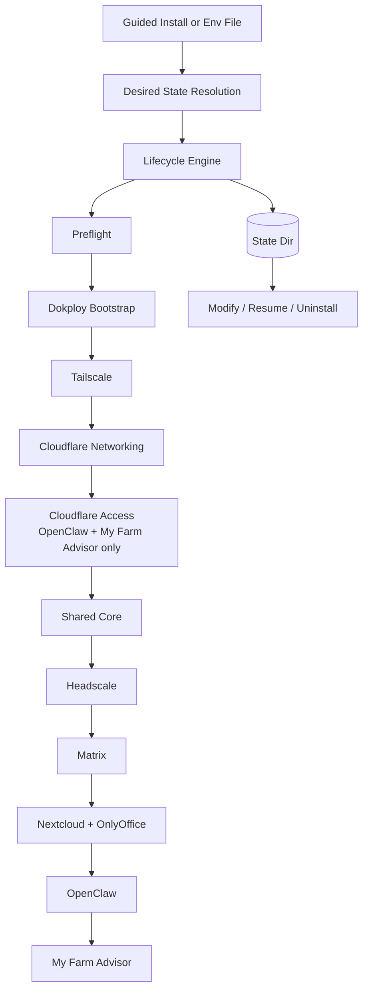
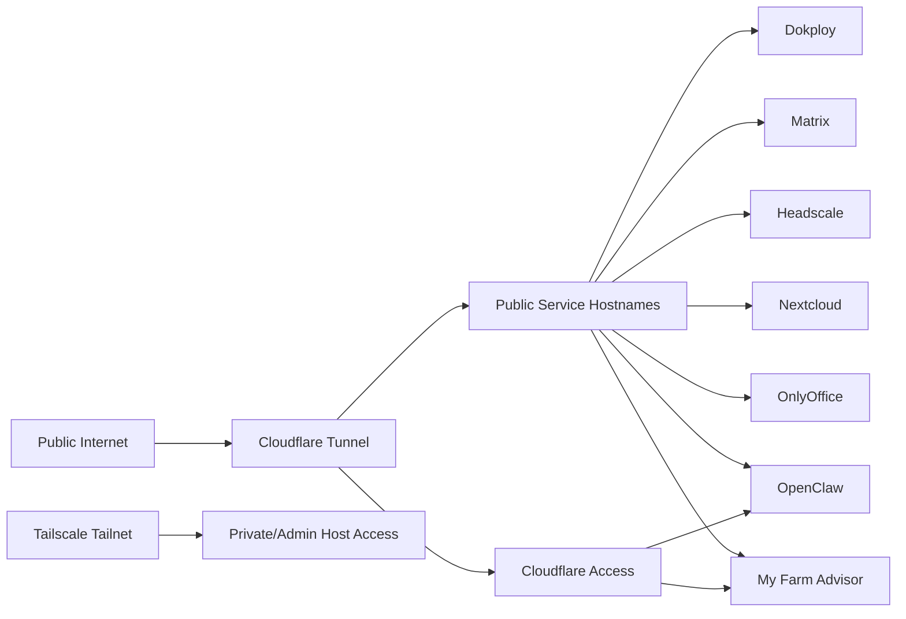
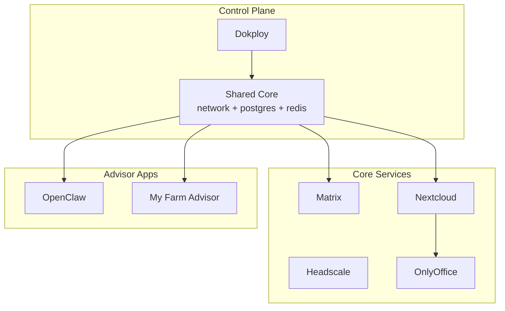

# Dokploy Wizard

Dokploy Wizard is a Python-first CLI for standing up a self-hosted business stack on a fresh VPS with:

- **Dokploy** as the deployment control plane
- **Cloudflare Tunnel** for public ingress
- **Tailscale** for private/admin host access
- **Cloudflare Access** for extra protection on browser-safe advisor apps
- **Stateful rerun / modify / uninstall** behavior backed by a persisted ownership ledger

The project is built to be **guided for first-time operators** and **repeatable for power users**.

## Current status

This repo is now beyond a mock CLI scaffold. The following pieces are implemented and verified:

- guided first-run install with reusable env-file generation
- persisted state documents (`raw-input`, `desired-state`, `applied-state`, `ownership-ledger`)
- no-op reruns, supported modify flows, and checkpoint-based resume
- safe uninstall with retain-data and destroy-data modes
- real Dokploy-backed deployment for:
  - shared core
  - Headscale
  - Matrix
  - Nextcloud + OnlyOffice
- Tailscale host-level phase
- Cloudflare Access hardening for:
  - OpenClaw
  - My Farm Advisor

Still intentionally **not** implemented:

- Cloudflare Access in front of Dokploy itself
  - the wizard’s own Dokploy API automation still needs a machine-auth or bypass path first
- Cloudflare Access in front of Matrix, Headscale, OnlyOffice, or the main Nextcloud hostname
  - those surfaces are protocol/integration sensitive in the current architecture

## What the wizard manages



## Ingress and security model



### Cloudflare Access scope today

Protected by Access email/PIN:

- `openclaw.<root-domain>`
- `farm.<root-domain>`

Not wrapped by Access in the current implementation:

- `dokploy.<root-domain>`
- `matrix.<root-domain>`
- `headscale.<root-domain>`
- `nextcloud.<root-domain>`
- `office.<root-domain>`

Why:

- **Matrix** must remain reachable by Matrix clients
- **Headscale** is a control-plane endpoint, not a browser login surface
- **OnlyOffice** must interoperate directly with Nextcloud
- **Nextcloud** also serves non-browser clients in the general case
- **Dokploy** still shares its browser/API surface from the wizard’s point of view

## CLI commands

```bash
./bin/dokploy-wizard --help
./bin/dokploy-wizard install --help
./bin/dokploy-wizard modify --help
./bin/dokploy-wizard uninstall --help
./bin/dokploy-wizard inspect-state --help
```

### Install modes

#### 1. Guided first-run install

Use this when you do **not** already have an env file:

```bash
./bin/dokploy-wizard install
```

The wizard will prompt for:

- wizard state directory (default or custom path)
- root domain
- stack name (default derived from the root domain, for example `openmerge`)
- Dokploy subdomain (default: `dokploy`)
- Dokploy admin email + password
- private network mode:
  - `headscale` (default)
  - `tailscale` (join existing)
  - `none`
- Cloudflare credentials
- optional guided Cloudflare help with links for:
  - API token creation
  - Account ID lookup
  - Zone ID lookup
  - minimum token permissions
- optional Tailscale settings only when `tailscale` mode is chosen
- pack selection

Then it writes a reusable env file, bootstraps Dokploy locally, mints the Dokploy API key automatically, and runs the same install flow as env-file mode.

The wizard state directory stores only wizard metadata and the generated `install.env`. It does **not** decide where Docker or Dokploy store deployed service data.

### Cloudflare prerequisites for guided install

If you answer **yes** to the Cloudflare help prompt, the wizard prints the exact links a new user needs:

- Create token: https://dash.cloudflare.com/profile/api-tokens
- Token docs: https://developers.cloudflare.com/fundamentals/api/get-started/create-token/
- Find Account ID / Zone ID: https://developers.cloudflare.com/fundamentals/account/find-account-and-zone-ids/

Minimum recommended token permissions for the current wizard:

- **DNS Write** on the target **Zone**
- add **Zone Read** when zone lookup/validation is needed

Cloudflare values in the wizard mean:

- **Cloudflare account ID** = the Cloudflare account that owns tunnel / Access resources
- **Cloudflare zone ID** = the DNS zone for your chosen root domain

#### 2. Reusable env-file install

```bash
./bin/dokploy-wizard install --env-file path/to/install.env --non-interactive
```

#### 3. Dry-run install

```bash
./bin/dokploy-wizard install --env-file path/to/install.env --dry-run
```

## State model

The wizard persists all lifecycle decisions in a state directory.

Default state directory:

```text
.dokploy-wizard-state/
```

Documents:

- `raw-input.json` — normalized env input
- `desired-state.json` — resolved target model
- `applied-state.json` — completed phase prefix
- `ownership-ledger.json` — exact wizard-owned resources

Important: the chosen state directory is **not** the same thing as deployment storage. Preflight disk checks are based on the host deployment storage path (Docker storage if detectable, otherwise `/`).

This is what makes these safe operations possible:

- no-op reruns
- supported modify flows
- resume after failure
- uninstall without guessing resource names

## How to test it locally

### Quick confidence checks

```bash
pytest -q
ruff check .
mypy .
```

### Core manual flow from a clean workspace

These are the high-value CLI checks that the project is expected to support in sequence:

```bash
rm -rf .dokploy-wizard-state

./bin/dokploy-wizard install --env-file fixtures/full.env --non-interactive
./bin/dokploy-wizard install --env-file fixtures/full.env --non-interactive
./bin/dokploy-wizard modify --env-file fixtures/modify-domain.env --non-interactive
./bin/dokploy-wizard uninstall --retain-data --non-interactive --confirm-file fixtures/retain.confirm
./bin/dokploy-wizard uninstall --destroy-data --non-interactive --confirm-file fixtures/destroy.confirm
```

What this proves:

- first install works
- second install becomes a noop rerun
- modify reuses owned resources and reruns only affected phases
- retain uninstall preserves data-bearing resources
- destroy uninstall clears the remaining owned state

### Guided install smoke test

Run the installer without `--env-file`:

```bash
./bin/dokploy-wizard install --dry-run
```

Use this to confirm the first-run prompt path works and writes a reusable env file.

### Guided install behavior details

- Guided install lets you choose where wizard state and the generated `install.env` are written.
- If you choose `headscale` as the private network control plane, the wizard does **not** ask for a Tailscale auth key.
- If you choose `tailscale`, the wizard assumes you want to join an existing Tailscale network and then asks for:
  - auth key
  - hostname
  - SSH enablement
  - optional tags
  - optional subnet routes
- Guided first-run install no longer asks for a Dokploy API key up front. It bootstraps Dokploy first and generates that key automatically.

### Focused test modules

```bash
pytest tests/unit/test_tailscale_phase.py -q
pytest tests/integration/test_tailscale_phase.py -q

pytest tests/unit/test_cloudflare_scopes.py -q
pytest tests/integration/test_networking_reconciler.py -q

pytest tests/integration/test_headscale_pack.py -q
pytest tests/integration/test_matrix_pack.py -q
pytest tests/integration/test_nextcloud_pack.py -q
pytest tests/integration/test_openclaw_pack.py -q

pytest tests/e2e/test_rerun_modify_resume.py -q
pytest tests/e2e/test_destroy_confirmation.py -q
```

## Fresh-VPS reality check

As of the current repo state, the wizard now has real deployment paths for the major core services, not just planner mocks.

Implemented as real Dokploy-backed or host-backed behavior:

- Dokploy bootstrap
- shared core
- Headscale
- Matrix
- Nextcloud + OnlyOffice
- Tailscale host access
- Cloudflare Tunnel + DNS
- Cloudflare Access for advisor apps

This means the project is now in **real deployment territory**, not just simulation territory.

That said, there are still practical follow-ups you should expect before calling it production-complete for your exact environment:

- add a safe machine-auth/bypass model before protecting Dokploy itself with Cloudflare Access
- document operational prerequisites clearly (Dokploy API key creation, Cloudflare token creation, Tailscale auth key creation)
- continue hardening/operational testing against an actual fresh VPS

## Example service model



## Notes for operators

- The shell wrapper in `bin/dokploy-wizard` is still dispatch-only.
- All orchestration logic lives under `src/dokploy_wizard/`.
- The ownership ledger is the uninstall authority; if the wizard does not own it, uninstall should not guess at it.
- There is a known unrelated environment warning from `pytest_asyncio`; it does not currently indicate a project failure.

## Near-term follow-up work

The biggest remaining follow-up items are:

1. Add a safe Dokploy machine-auth / Access coexistence story before Access-protecting Dokploy
2. Keep validating the wizard on real fresh VPSes
3. Continue production hardening around operator workflows and service-specific operational concerns
