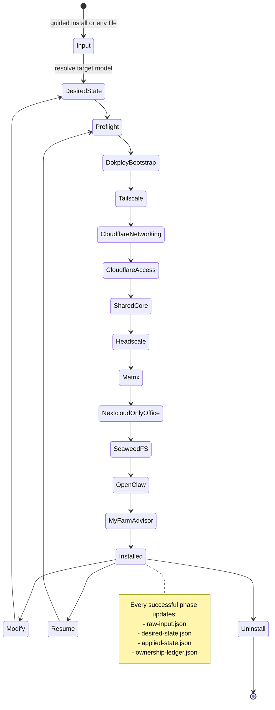
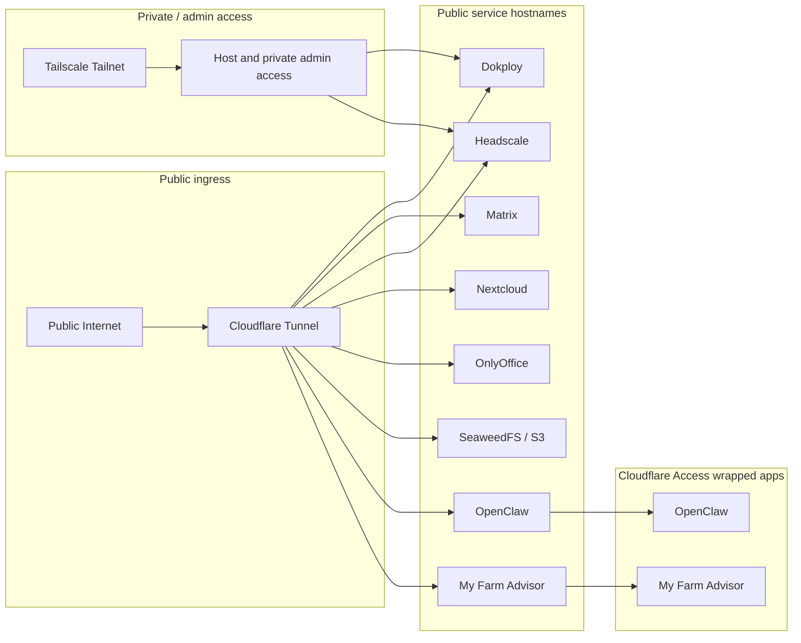
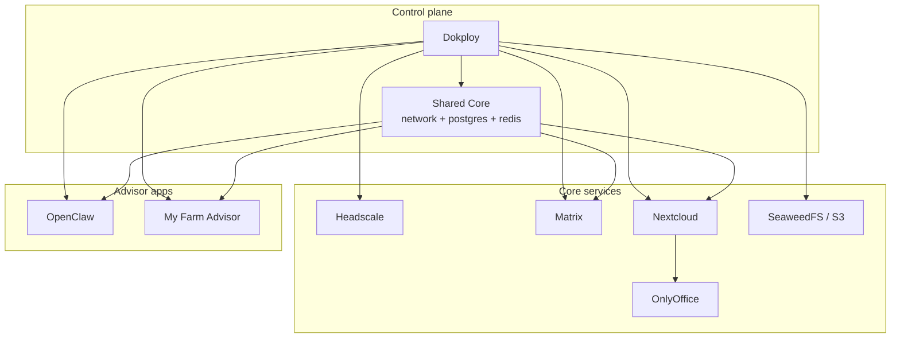

# Dokploy Wizard

Dokploy Wizard is a Python-first CLI for standing up a self-hosted business stack on a fresh VPS with:

- **Dokploy** as the deployment control plane
- **Cloudflare Tunnel** for public ingress
- **Tailscale** for private/admin host access
- **Cloudflare Access** for extra protection on browser-safe advisor apps
- **Stateful rerun / modify / uninstall** behavior backed by a persisted ownership ledger

The project is built to be **guided for first-time operators** and **repeatable for power users**.

## Current status

This repo is now beyond a mock CLI scaffold. The following pieces are implemented and verified:

- guided first-run install with reusable env-file generation
- persisted state documents (`raw-input`, `desired-state`, `applied-state`, `ownership-ledger`)
- no-op reruns, supported modify flows, and checkpoint-based resume
- safe uninstall with retain-data and destroy-data modes
- real Dokploy-backed deployment for:
  - shared core
  - Headscale
  - Matrix
  - Nextcloud + OnlyOffice
  - SeaweedFS
- Tailscale host-level phase
- Cloudflare Access hardening for:
  - OpenClaw
  - My Farm Advisor

Still intentionally **not** implemented:

- Cloudflare Access in front of Dokploy itself
  - the wizard’s own Dokploy API automation still needs a machine-auth or bypass path first
- Cloudflare Access in front of Matrix, Headscale, OnlyOffice, or the main Nextcloud hostname
  - those surfaces are protocol/integration sensitive in the current architecture

## What the wizard manages



## Ingress and security model



### Cloudflare Access scope today

Protected by Access email/PIN:

- `openclaw.<root-domain>`
- `farm.<root-domain>`

Not wrapped by Access in the current implementation:

- `dokploy.<root-domain>`
- `matrix.<root-domain>`
- `headscale.<root-domain>`
- `nextcloud.<root-domain>`
- `office.<root-domain>`
- `s3.<root-domain>`

Why:

- **Matrix** must remain reachable by Matrix clients
- **Headscale** is a control-plane endpoint, not a browser login surface
- **OnlyOffice** must interoperate directly with Nextcloud
- **Nextcloud** also serves non-browser clients in the general case
- **SeaweedFS / S3** is a protocol endpoint, not a browser login surface
- **Dokploy** still shares its browser/API surface from the wizard’s point of view

## CLI commands

```bash
./bin/dokploy-wizard --help
./bin/dokploy-wizard install --help
./bin/dokploy-wizard modify --help
./bin/dokploy-wizard uninstall --help
./bin/dokploy-wizard inspect-state --help
```

### Install modes

#### 1. Guided first-run install

Use this when you do **not** already have an env file:

```bash
./bin/dokploy-wizard install
```

The wizard will prompt for:

- wizard state directory (default or custom path)
- root domain
- stack name (default derived from the root domain, for example `openmerge`)
- Dokploy subdomain (default: `dokploy`)
- Dokploy admin email + password
- private network mode:
  - `headscale` (default)
  - `tailscale` (join existing)
  - `none`
- Cloudflare credentials
- optional guided Cloudflare help with links for:
  - API token creation
  - Account ID lookup
  - Zone ID lookup
  - minimum token permissions
- Cloudflare zone ID is optional in guided mode; if left blank, the wizard uses your root domain and looks the Zone ID up automatically
- optional Tailscale settings only when `tailscale` mode is chosen
- pack selection

Then it writes a reusable env file, bootstraps Dokploy locally, mints the Dokploy API key automatically, and runs the same install flow as env-file mode.

Current first-VPS contract for this guided path:

- start from a fresh Ubuntu 24.04 host
- Docker must already be installed and the local Docker daemon must be reachable
- Dokploy reuse detection is intentionally narrow in this pass: the wizard only treats Dokploy as already present when the host has a local Docker Swarm service named `dokploy` and local HTTP health succeeds on `http://127.0.0.1:3000`
- already-installed Dokploy on nonstandard topologies, reverse-proxied layouts, or remote/non-local control-plane setups is out of scope for this pass

Sizing guidance for operators:

- **Core**: 2 vCPU, 4 GB RAM, 40 GB disk
- **Recommended**: 4 vCPU, 8 GB RAM, 100 GB disk
- **Full Pack Set**: 6 vCPU, 12 GB RAM, 150 GB disk

Treat those tiers as planning targets, not auto-negotiated hints. If your host is underprovisioned, reduce the selected scope or pack profile before install. Do not expect the wizard to silently downgrade CPU, disk, or enabled packs to make the host fit.

Memory is the only explicit install-time continuation path below the recommended threshold. If preflight reports only a memory shortfall, you can continue by confirming the prompt in guided mode or by passing `--allow-memory-shortfall` in non-interactive mode. That override means you are choosing to proceed below the recommended production target, not that the host is now treated as equivalent to meeting it. There is no matching CPU or disk override.

Treat the generated `install.env` as sensitive: it contains credentials, the wizard writes it with owner-only permissions (`0600`), and you should keep it out of version control.

The wizard state directory stores only wizard metadata and the generated `install.env`. It does **not** decide where Docker or Dokploy store deployed service data.

### Cloudflare prerequisites for guided install

If you answer **yes** to the Cloudflare help prompt, the wizard now prints direct setup instructions instead of just sending you to docs.

The beginner path is:

1. Open: https://dash.cloudflare.com/profile/api-tokens
2. Click: **Create Token** → **Create Custom Token**
   Minimum token permissions for this wizard:
   - `Account -> Cloudflare Tunnel -> Edit`
   - `Zone -> DNS -> Edit`
   - `Account -> Access: Apps and Policies -> Edit`
   - `Account -> Access: Organizations, Identity Providers, and Groups -> Edit`
3. Find the Zone ID for your root domain
   - Cloudflare dashboard → your domain → **Overview** → **API** section → **Zone ID**
   - if you are unsure which zone to use, use the root domain itself
   - good: `openmerge.me`
   - do **not** use `dokploy.openmerge.me`

Cloudflare values in the wizard mean:

- **Cloudflare account ID** = the Cloudflare account that owns tunnel and Access resources
  - find it in Cloudflare dashboard → **Account home** → your account row → **Copy account ID**
- **Cloudflare zone ID** = the DNS zone ID for your root domain

If you still need official references after that, the wizard/README points to:

- Token docs: https://developers.cloudflare.com/fundamentals/api/get-started/create-token/
- Account ID / Zone ID docs: https://developers.cloudflare.com/fundamentals/account/find-account-and-zone-ids/

#### 2. Reusable env-file install

```bash
./bin/dokploy-wizard install --env-file path/to/install.env --non-interactive
```

`install.env` is a sensitive operator file. Keep it private, keep it out of git, and expect the CLI to warn on non-dry-run `install`/`modify` runs if its permissions are broader than owner-only.

#### 3. Dry-run install

```bash
./bin/dokploy-wizard install --env-file path/to/install.env --dry-run
```

## State model

The wizard persists all lifecycle decisions in a state directory.

Default state directory:

```text
.dokploy-wizard-state/
```

Documents:

- `raw-input.json` — normalized env input
- `desired-state.json` — resolved target model
- `applied-state.json` — completed phase prefix
- `ownership-ledger.json` — exact wizard-owned resources

Important: the chosen state directory is **not** the same thing as deployment storage. Preflight disk checks are based on the host deployment storage path (Docker storage if detectable, otherwise `/`).

This is what makes these safe operations possible:

- no-op reruns
- supported modify flows
- resume after failure
- uninstall without guessing resource names

## How to test it locally

### Quick confidence checks

```bash
pytest -q
ruff check .
mypy .
```

### Core manual flow from a clean workspace

These are the high-value CLI checks that the project is expected to support in sequence:

```bash
rm -rf .dokploy-wizard-state

./bin/dokploy-wizard install --env-file fixtures/full.env --non-interactive
./bin/dokploy-wizard install --env-file fixtures/full.env --non-interactive
./bin/dokploy-wizard modify --env-file fixtures/modify-domain.env --non-interactive
./bin/dokploy-wizard uninstall --retain-data --non-interactive --confirm-file fixtures/retain.confirm
./bin/dokploy-wizard uninstall --destroy-data --non-interactive --confirm-file fixtures/destroy.confirm
```

What this proves:

- first install works
- second install becomes a noop rerun
- modify reuses owned resources and reruns only affected phases
- retain uninstall preserves data-bearing resources
- destroy uninstall clears the remaining owned state

### Guided install smoke test

Run the installer without `--env-file`:

```bash
./bin/dokploy-wizard install --dry-run
```

Use this to confirm the first-run prompt path works and writes a reusable env file.

### Guided install behavior details

- Guided install lets you choose where wizard state and the generated `install.env` are written.
- If you choose `headscale` as the private network control plane, the wizard does **not** ask for a Tailscale auth key.
- If you choose `tailscale`, the wizard assumes you want to join an existing Tailscale network and then asks for:
  - auth key
  - hostname
  - SSH enablement
  - optional tags
  - optional subnet routes
- Guided first-run install no longer asks for a Dokploy API key up front. It bootstraps Dokploy first and generates that key automatically.
- If you enable SeaweedFS, guided install asks for:
  - no manual keys up front
  - the wizard generates the SeaweedFS access key and secret key for you
  - it prints them clearly at the end and saves them into the generated `install.env`
- If you do not want generated secrets echoed to stdout during install, add `--no-print-secrets`; the wizard still saves the generated values into `install.env`.
- If you enable OpenClaw and leave channels at the default, it defaults to `matrix`

### Focused test modules

```bash
pytest tests/unit/test_tailscale_phase.py -q
pytest tests/integration/test_tailscale_phase.py -q

pytest tests/unit/test_cloudflare_scopes.py -q
pytest tests/integration/test_networking_reconciler.py -q

pytest tests/integration/test_headscale_pack.py -q
pytest tests/integration/test_matrix_pack.py -q
pytest tests/integration/test_nextcloud_pack.py -q
pytest tests/integration/test_openclaw_pack.py -q

pytest tests/e2e/test_rerun_modify_resume.py -q
pytest tests/e2e/test_destroy_confirmation.py -q
```

## Fresh-VPS reality check

As of the current repo state, the wizard now has real deployment paths for the major core services, not just planner mocks.

This is still a first-VPS workflow, not a general Dokploy adoption or migration tool. The current contract is:

- the host is expected to be a fresh Ubuntu 24.04 VPS
- Docker must already be installed and reachable before `dokploy-wizard install` runs
- existing Dokploy is only recognized when Docker can inspect a local Swarm service named `dokploy` and the wizard can reach Dokploy locally at `127.0.0.1:3000`
- hosts with pre-existing Dokploy installs wired up some other way are out of scope for this pass

Resource planning for that contract is explicit:

- **Core**: 2 vCPU, 4 GB RAM, 40 GB disk
- **Recommended**: 4 vCPU, 8 GB RAM, 100 GB disk
- **Full Pack Set**: 6 vCPU, 12 GB RAM, 150 GB disk

If a host falls short, the operator should scale back the selected scope or profile. The wizard does not silently reduce enabled packs, CPU expectations, or disk requirements at runtime.

The only explicit continuation below the recommended target is install-time memory override. When preflight finds only a memory warning, guided install can continue after confirmation and non-interactive install can continue with `--allow-memory-shortfall`. That is an explicit operator choice to proceed below the recommended production floor. CPU and disk shortfalls still stop the run.

Implemented as real Dokploy-backed or host-backed behavior:

- Dokploy bootstrap
- shared core
- Headscale
- Matrix
- Nextcloud + OnlyOffice
- SeaweedFS
- Tailscale host access
- Cloudflare Tunnel + DNS
- Cloudflare Access for advisor apps

This means the project is now in **real deployment territory**, not just simulation territory.

That said, there are still practical follow-ups you should expect before calling it production-complete for your exact environment:

- add a safe machine-auth/bypass model before protecting Dokploy itself with Cloudflare Access
- document operational prerequisites clearly (Dokploy API key creation, Cloudflare token creation, Tailscale auth key creation)
- continue hardening/operational testing against an actual fresh VPS

## Example service model



## Notes for operators

- The shell wrapper in `bin/dokploy-wizard` is still dispatch-only.
- All orchestration logic lives under `src/dokploy_wizard/`.
- The ownership ledger is the uninstall authority; if the wizard does not own it, uninstall should not guess at it.
- There is a known unrelated environment warning from `pytest_asyncio`; it does not currently indicate a project failure.

## Near-term follow-up work

The biggest remaining follow-up items are:

1. Add a safe Dokploy machine-auth / Access coexistence story before Access-protecting Dokploy
2. Keep validating the wizard on real fresh VPSes
3. Continue production hardening around operator workflows and service-specific operational concerns
