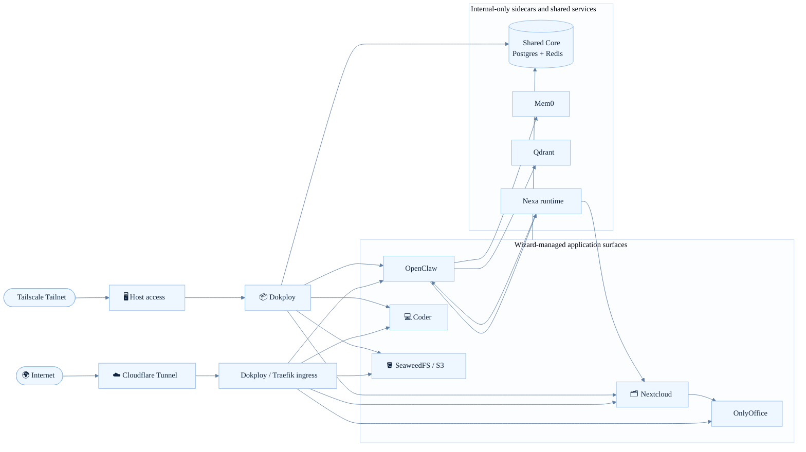
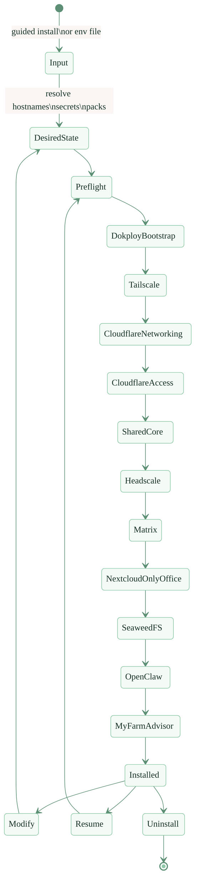
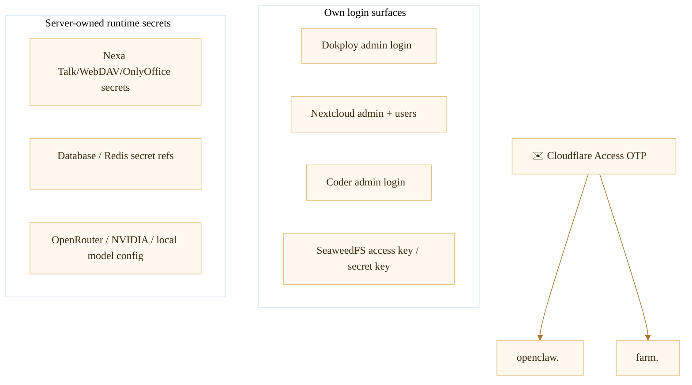

# Dokploy Wizard

Dokploy Wizard is a Python-first installer for standing up a real self-hosted stack on a fresh Ubuntu VPS with Dokploy, Cloudflare Tunnel, optional Cloudflare Access, optional Tailscale host access, and a set of opinionated application packs.

Today this repo is not a scaffold or mock planner. It performs real deployment, real rerun/modify/uninstall flows, and has been validated on fresh VPS rebuilds.

## What it installs

- **Dokploy** as the deployment control plane
- **Cloudflare Tunnel** for public ingress
- **Cloudflare Access** for browser-safe advisor surfaces
- **Tailscale** for private/admin host access
- **Shared Core** services used by packs
  - PostgreSQL
  - Redis
- **Nextcloud + OnlyOffice**
- **Moodle**
- **DocuSeal**
- **OpenClaw**
- **Nexa**, embedded inside OpenClaw as the Nextcloud/Talk/OnlyOffice-facing agent runtime
- **Telly**, embedded inside OpenClaw as the Telegram-facing agent persona
- **SeaweedFS** for S3-compatible object storage
- **Coder** with a seeded Ubuntu + VS Code workspace template

Optional packs also include Headscale, Matrix, and My Farm Advisor.

## Current reality

- Fresh-VPS install works
- Same-host rerun / noop proof works
- fresh-VPS install, rerun, and inspect-state flows are part of the validation path
- OpenClaw, Nexa, Nextcloud Talk, OnlyOffice, SeaweedFS, and Coder are all part of the wizard-managed path

## High-level architecture



## Install and lifecycle flow



## What each major surface does

### Dokploy

Dokploy is the control plane the wizard targets for all compose app deployment. The wizard bootstraps Dokploy, mints or reuses an API key, and then uses that API key for all managed pack operations.

### Shared Core

Shared Core is the common substrate for packs that need databases or cache services. Today that means:

- PostgreSQL for Coder, Nextcloud, and OpenClaw
- Redis for Nextcloud

These are wizard-owned resources, tracked in the ownership ledger, and reused across modify / rerun operations.

### Nextcloud + OnlyOffice

The `nextcloud` pack always includes OnlyOffice as its paired document editor runtime.

What the wizard wires today:

- Nextcloud service + persistent volume
- OnlyOffice service + persistent volume
- shared-core Postgres + Redis bindings
- trusted domain configuration
- OnlyOffice JWT configuration wiring
- Nextcloud Talk app verification
- OpenClaw workspace mount into Nextcloud when Nexa is enabled

### OpenClaw

OpenClaw is deployed as an advisor runtime with:

- browser-facing access through Cloudflare Tunnel
- Cloudflare Access OTP protection on its public hostname
- trusted-proxy browser auth for the Control UI
- generated gateway config and agent bindings
- `gateway.http.endpoints.responses.enabled = true` so internal adapters can hand requests into OpenClaw’s own runtime

### Nexa

Nexa is **not** a standalone pack. It is embedded inside the OpenClaw deployment when `OPENCLAW_NEXA_*` env values are present.

Nexa’s current role is to bridge OpenClaw into the Nextcloud ecosystem:

- Nextcloud Talk message handling
- Nextcloud file creation and sharing via WebDAV/OCS
- OnlyOffice callback ingestion and reconcile contract wiring
- Mem0-backed memory lookup and memory write policy
- OpenClaw pass-through for grounded tool use and command execution

The important design point is that Nexa is not just a prompt file. The wizard deploys a dedicated `nexa-runtime` sidecar and associated contract files under the OpenClaw volume, but some Talk and OnlyOffice behaviors are still intentionally conservative and continue to depend on upstream OpenClaw/runtime behavior.

### Telly

Telly is the Telegram-facing OpenClaw agent persona. Like Nexa, it is seeded by the OpenClaw deployment code rather than installed as a separate pack.

What the wizard currently does for Telly:

- seeds a dedicated Telegram-facing agent persona
- binds the Telegram channel to `telly`
- configures Telegram DM allowlist / ownership values from `OPENCLAW_TELEGRAM_*`
- seeds a `workspace-telly` with operator-facing guidance files

### Coder

Coder gets a seeded Ubuntu + VS Code template and a first default workspace.

On first successful bootstrap the wizard:

- provisions the initial Coder admin
- pushes the seeded templates:
  - `ubuntu-vscode`
  - `ubuntu-vscode-opencode-web`
  - `ubuntu-vscode-openwork`
  - `ubuntu-vscode-kdense-byok`
  - `ubuntu-vscode-hermes`
- creates a default workspace for the operator

That default template installs:

- `curl`
- `git`
- `wget`
- `btop`
- `opencode`
- `zellij`

The workspace home directory lives on a per-workspace Docker volume. The control plane state lives in shared-core Postgres.

### Coder App Hostnames

The wizard supports two different ideas for how browser-facing Coder apps should be routed:

- The ideal Coder-native shape is `*.coder.<root-domain>`.
- The currently selected no-fee fallback is `*.<root-domain>` limited by a strict app-host pattern, so only Coder app-style hostnames route into Coder.

Why the fallback exists:

- Cloudflare Universal SSL on a full zone covers the zone apex and first-level subdomains.
- A hostname like `foo.coder.example.com` is a deeper subdomain and is not covered by Universal SSL.
- Cloudflare's supported paid fix is Advanced Certificate Manager, which can issue edge certificates for `*.coder.<root-domain>`.

Current decision:

- Keep the fallback `*.<root-domain>` for live installs until a future architecture change is chosen.
- Preserve a strict router pattern so service hosts like `dokploy.<root-domain>`, `nextcloud.<root-domain>`, and `openclaw.<root-domain>` are not hijacked by Coder.

Future architecture options:

1. Keep the current fallback: lowest risk and already working. Coder app hosts look like `app--workspace--user.<root-domain>`.
2. Use `*.coder.<root-domain>` with Cloudflare Advanced Certificate Manager: closest to the Coder docs and cleanest hostname model, but requires ACM on the zone.
3. Keep `*.coder.<root-domain>` but move Coder off Cloudflare Tunnel: terminate public TLS directly in Dokploy/Traefik using DNS-01 wildcard certificates. This avoids the ACM fee but changes the ingress architecture for Coder.
4. Convert selected Coder apps to path-based routing: works without wildcard subdomain TLS, but app compatibility is weaker than subdomain routing and usually requires template-specific base-path work.

Operational note:

- Hermes, OpenCode Web, and OpenWork are already path-based Coder apps in this repo.
- K-Dense BYOK is the current outlier that uses `subdomain = true` and benefits the most from proper wildcard app routing.

### SeaweedFS

SeaweedFS provides the S3-compatible object-storage surface. The wizard wires:

- service + data volume
- generated access key + secret key in guided mode
- public `s3.<root-domain>` hostname

## Auth and credential model

### Auth boundaries at a glance



### Which surfaces are behind OTP

Current Cloudflare Access scope:

- `openclaw.<root-domain>`
- `farm.<root-domain>`

Not behind Cloudflare Access in the current implementation:

- `dokploy.<root-domain>`
- `nextcloud.<root-domain>`
- `office.<root-domain>`
- `s3.<root-domain>`
- `coder.<root-domain>`
- Coder workspace app hosts, currently routed via a controlled `*.<root-domain>` fallback
- `matrix.<root-domain>`
- `headscale.<root-domain>`

Why:

- Dokploy still needs a usable API/control plane path
- Nextcloud and OnlyOffice have client/protocol concerns
- SeaweedFS is an object-storage protocol surface
- Coder has its own application login
- Matrix and Headscale are protocol/control-plane surfaces

### Which things have their own login/credentials

| Surface | Credential model | Source |
|---|---|---|
| Dokploy | admin email + password, then API key | operator-supplied + wizard-generated API key |
| OpenClaw | Cloudflare Access OTP + trusted-proxy browser auth, plus gateway password/token surfaces | generated gateway password, optional token |
| Nextcloud | admin user/password and internal service accounts | currently derived from Dokploy admin credentials, plus Nexa service account from env |
| OnlyOffice | JWT integration value shared with Nextcloud | currently wired by deployment bootstrap/runtime config |
| Coder | Coder admin login | currently derived from Dokploy admin credentials |
| SeaweedFS / S3 | access key + secret key | wizard-generated in guided mode or env-file provided |
| Nexa internals | Talk/WebDAV/OnlyOffice/API secrets | server-owned env |

### Credential sources

The wizard currently uses three broad credential sources:

1. **Operator-supplied values**
   - Cloudflare token/account/zone
   - Dokploy admin login
   - Tailscale auth key
   - model/provider API keys

2. **Wizard-generated values**
   - SeaweedFS access key + secret key in guided mode
   - OpenClaw browser/control password in guided mode
   - My Farm Advisor browser/control password in guided mode
   - Dokploy API key after bootstrap

3. **Server-owned runtime secrets**
   - Nextcloud and Nexa runtime integration values
   - Nexa Talk signing/shared secrets
   - Nexa WebDAV auth
   - Nexa service-account credentials
   - Mem0/Qdrant private runtime configuration

### Nexa credential mediation

Nexa is intentionally treated as a server-owned runtime surface.

That means:

- the wizard keeps sensitive Nexa values in env/config surfaces owned by the deployment
- the Nextcloud-visible Nexa workspace is an operator/user surface, not the source of truth
- the runtime contract records **presence and source**, not raw secret values

## Current install file expectations

The current repo uses `.install.env` at repo root as the working operator env file.

Important details:

- it contains sensitive credentials and should remain `0600`
- the fresh-VPS harness copies it explicitly to the remote host
- Nexa functionality is enabled by the presence of `OPENCLAW_NEXA_*` values
- runtime-only values like internal sidecar URLs are synthesized later during deployment

## Current fresh-VPS proof status

The repo includes a real fresh-VPS proof flow with:

- first install success
- same-host rerun/noop success
- `inspect-state` execution as part of the proof loop

The local proof artifacts live under:

- `.sisyphus/evidence/fresh-vps-validation/fresh-reinstall-live-proof/`

What that means in practice:

- the wizard can package the repo and install env
- copy both to a fresh host
- run the installer non-interactively
- rerun it on the same host
- inspect the resulting state as part of the same reproducibility loop

The checked-in proof artifact is useful as a concrete example run, but it should not be treated as the only source of truth for current drift status after later inspection fixes.

## Install modes

### Guided first-run install

```bash
./bin/dokploy-wizard install
```

Use this when you do not already have an env file. The wizard prompts for domains, Dokploy credentials, Cloudflare values, optional Tailscale settings, and pack selection, then writes a reusable env file and runs the same install flow as env-file mode.

### Env-file install

```bash
./bin/dokploy-wizard install --env-file path/to/install.env --non-interactive
```

### Inspect state

```bash
./bin/dokploy-wizard inspect-state --env-file path/to/install.env --state-dir .dokploy-wizard-state
```

### Modify / rerun / uninstall

```bash
./bin/dokploy-wizard modify --env-file path/to/install.env --non-interactive
./bin/dokploy-wizard uninstall --retain-data --non-interactive --confirm-file fixtures/retain.confirm
./bin/dokploy-wizard uninstall --destroy-data --non-interactive --confirm-file fixtures/destroy.confirm
```

## Fresh-VPS harness

The repo also contains a real fresh-host validation harness:

```bash
python -m src.dokploy_wizard.fresh_vps_validation_harness \
  --install-env-file ./.install.env \
  --target-host <host> \
  --target-user root \
  --target-password <password> \
  --target-path /root/dokploy-proof \
  --label proof-run
```

What it does:

- packages the repo
- uploads repo + `.install.env`
- runs wizard install
- reruns the same install for noop proof
- runs `inspect-state`
- collects remote state and logs locally

## Local validation

Quick checks:

```bash
pytest -q
ruff check .
mypy .
```

Focused modules that matter most for the current stack:

```bash
pytest tests/unit/test_openclaw_pack.py -q
pytest tests/unit/test_nextcloud_pack.py -q
pytest tests/unit/test_nexa_runtime.py -q
pytest tests/integration/test_openclaw_pack.py -q
pytest tests/integration/test_nextcloud_pack.py -q
pytest tests/test_cli.py -q
```

## Operator notes

- This is still a **fresh-host** workflow, not a general migration framework.
- Docker can be bootstrap-remediated by the wizard on supported Ubuntu hosts.
- The chosen state directory stores wizard metadata and the generated env file, not the Docker volumes themselves.
- The ownership ledger is the uninstall authority.
- OpenClaw/Nexa/Telly behavior is now wizard-managed, not just manually drifted on one VPS.

## Current caveats

- Dokploy itself is not yet protected by Cloudflare Access because the wizard still needs a safe machine-auth/control path.
- Nexa features are env-gated, not universal defaults. For your deployment that is fine, because `.install.env` already carries the required `OPENCLAW_NEXA_*` values.
- Some channel/runtime behavior still depends on the upstream OpenClaw image, so operational behavior can evolve as that image evolves.

## Project layout

- `src/dokploy_wizard/cli.py` — lifecycle entrypoint and backend construction
- `src/dokploy_wizard/networking/` — Cloudflare tunnel/DNS/Access planning
- `src/dokploy_wizard/tailscale/` — host-level Tailscale phase
- `src/dokploy_wizard/dokploy/` — Dokploy-backed deployment backends
- `src/dokploy_wizard/packs/` — pack models and reconcilers
- `templates/` — deployment templates, including Coder template assets
- `tests/` — unit, integration, and lifecycle coverage

## Summary

Dokploy Wizard now installs a real, stateful self-hosted stack, not just a set of placeholders. It bootstraps Dokploy, wires ingress and auth, deploys application packs, embeds OpenClaw-facing agents like Nexa and Telly, and supports fresh-host reruns with state-aware lifecycle behavior.

The current repo is built around a real fresh-VPS proof workflow and is intended to be the baseline for repeatable full rebuilds.
