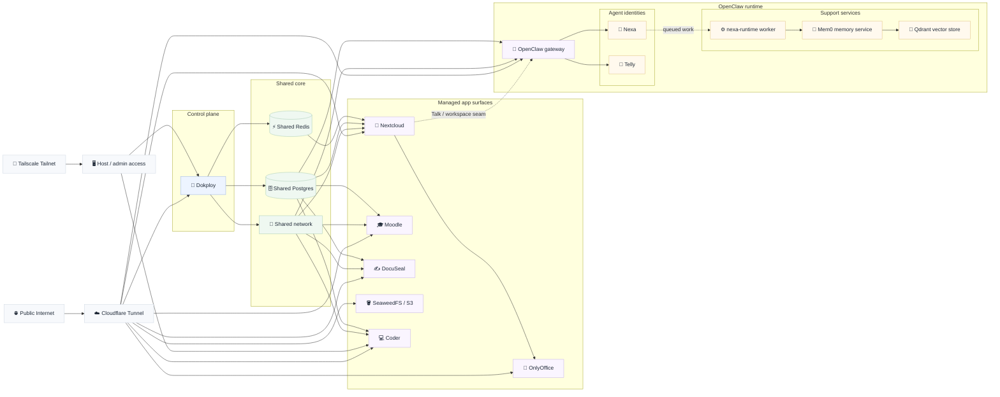
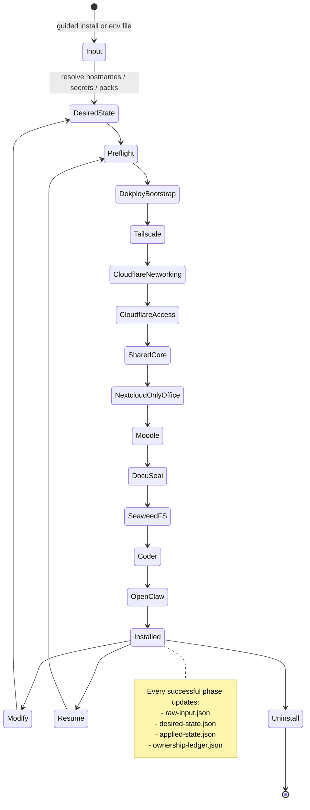
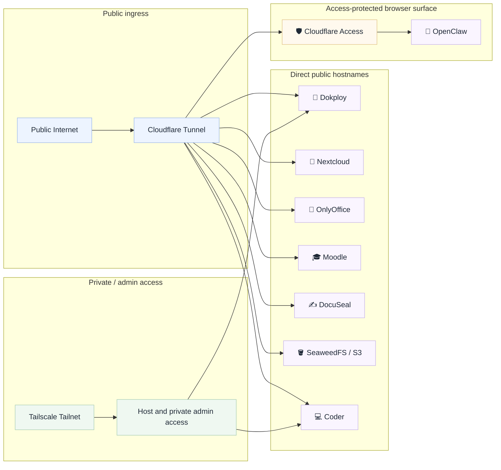
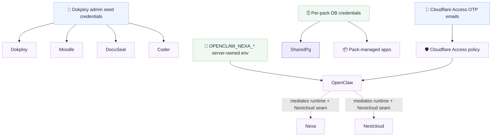

# Dokploy Wizard

Dokploy Wizard is a Python-first CLI for standing up a self-hosted business stack on a fresh VPS with:

- **Dokploy** as the deployment control plane
- **Cloudflare Tunnel** for public ingress
- **Tailscale** for private/admin host access
- **Cloudflare Access** for browser-safe protected surfaces
- **Stateful rerun / modify / uninstall** behavior backed by a persisted ownership ledger

The project is built to be **guided for first-time operators** and **repeatable for power users**.

## What it installs

Today’s stack can manage and validate these surfaces together:

- **Dokploy**
- **Cloudflare Tunnel + DNS**
- **Tailscale** host access
- **Shared Core**
  - shared network
  - shared Postgres
  - shared Redis
- **Nextcloud + OnlyOffice**
- **Moodle**
- **DocuSeal**
- **SeaweedFS / S3**
- **Coder**
- **OpenClaw**
- **Nexa** runtime inside OpenClaw
- **Telly** agent inside OpenClaw

## Current reality

This repo is now beyond a mock CLI scaffold. The following pieces are implemented and verified:

- guided first-run install with reusable env-file generation
- persisted state documents (`raw-input`, `desired-state`, `applied-state`, `ownership-ledger`)
- no-op reruns, supported modify flows, and checkpoint-based resume
- safe uninstall with retain-data and destroy-data modes
- real Dokploy-backed deployment for:
  - shared core
  - Nextcloud + OnlyOffice
  - Moodle
  - DocuSeal
  - SeaweedFS
  - Coder
  - OpenClaw
  - Nexa runtime sidecars (`mem0`, `qdrant`, `nexa-runtime`)
- Tailscale host-level phase
- Cloudflare Access hardening for OpenClaw

Still intentionally not implemented:

- Cloudflare Access in front of Dokploy itself
  - the wizard’s own Dokploy API automation still needs a machine-auth or bypass path first
- Cloudflare Access in front of Matrix, Headscale, OnlyOffice, or the main Nextcloud hostname
  - those surfaces are protocol/integration sensitive in the current architecture

## High-level architecture



## Lifecycle and state model



## What each major surface does

### Dokploy

Dokploy is the deployment control plane the wizard uses to create and reconcile compose applications. The wizard bootstraps Dokploy first, qualifies API auth, and then uses it as the anchor point for the rest of the stack.

### Shared Core

Shared Core is the common substrate for pack-managed applications. It provides the shared Docker network plus shared Postgres and Redis services, while still allocating per-pack databases, users, and secret references.

### Nextcloud + OnlyOffice

Nextcloud is the document and collaboration hub. OnlyOffice is paired to Nextcloud for browser editing. The current stack also restores the OpenClaw/Nexa seam back into Nextcloud, including the dedicated Nexa account and external workspace exposure.

### Moodle

Moodle is deployed as a first-class pack on shared Postgres. It is bootstrapped through the Moodle CLI installer, persists `moodledata`, uses a fixed canonical public URL, and now uses a safer writable-path model for plugin/content installation without requiring a broadly writable docroot.

### DocuSeal

DocuSeal is deployed as a first-class pack on shared Postgres. It uses deterministic first-boot automation, persistent app storage, explicit `SECRET_KEY_BASE`, and `/up` health checks.

### SeaweedFS / S3

SeaweedFS provides S3-compatible object storage. It is used as a managed protocol/data surface and is exposed at the `s3.<root-domain>` hostname.

### Coder

Coder provides the managed development workspace surface. The default workspace template now restores the richer bootstrap path so fresh workspaces get `btop`, `zellij`, and `opencode` available on PATH.

### OpenClaw

OpenClaw is the advisor/gateway runtime surfaced to users. It is deployed behind Cloudflare Tunnel and Access and now validates against real local health rather than Access redirect false positives.

### Nexa

Nexa runs inside the OpenClaw deployment, not as a separate pack. The current implementation restores the Nexa runtime sidecar, queue state, memory adapters, Nextcloud seam, and workspace contract.

### Telly

Telly is the Telegram-facing OpenClaw agent. It shares the OpenClaw runtime but has its own role and routing surface.

## Ingress and security model



### Cloudflare Access scope today

Protected by Access email/PIN:

- `openclaw.<root-domain>`

Not wrapped by Access in the current implementation:

- `dokploy.<root-domain>`
- `nextcloud.<root-domain>`
- `office.<root-domain>`
- `moodle.<root-domain>`
- `docuseal.<root-domain>`
- `coder.<root-domain>`
- `s3.<root-domain>`

Why:

- **Dokploy** still shares its browser/API surface from the wizard’s point of view
- **Nextcloud** serves both browser and non-browser clients
- **OnlyOffice** must interoperate directly with Nextcloud
- **Moodle** and **DocuSeal** are currently left as direct app surfaces in this stack shape
- **Coder** is not yet modeled behind Access in the current implementation
- **SeaweedFS / S3** is a protocol endpoint, not a browser login surface

## Auth and credential model



Key rules:

- Dokploy admin credentials are **seed credentials** for Moodle, DocuSeal, and initial Coder bootstrap.
- Shared Postgres credentials are allocated per pack, even though the underlying Postgres service is shared.
- Nexa credential mediation remains **server-owned env + durable runtime state**, not workspace-owned secrets.
- Later rotations of Dokploy admin credentials are not treated as automatic runtime reconciliation for Moodle/DocuSeal.

## CLI commands

```bash
./bin/dokploy-wizard --help
./bin/dokploy-wizard install --help
./bin/dokploy-wizard modify --help
./bin/dokploy-wizard uninstall --help
./bin/dokploy-wizard inspect-state --help
```

## Install modes

### 1. Guided first-run install

Use this when you do **not** already have an env file:

```bash
./bin/dokploy-wizard install
```

The wizard will prompt for:

- wizard state directory (default or custom path)
- root domain
- stack name (default derived from the root domain, for example `openmerge`)
- Dokploy subdomain (default: `dokploy`)
- Dokploy admin email + password
- private network mode:
  - `headscale` (default)
  - `tailscale` (join existing)
  - `none`
- Cloudflare credentials
- optional guided Cloudflare help with links for:
  - API token creation
  - Account ID lookup
  - Zone ID lookup
  - minimum token permissions
- Cloudflare zone ID is optional in guided mode; if left blank, the wizard uses your root domain and looks the Zone ID up automatically
- optional Tailscale settings only when `tailscale` mode is chosen
- pack selection

Then it writes a reusable env file, bootstraps Dokploy locally, mints the Dokploy API key automatically, and runs the same install flow as env-file mode.

Current first-VPS contract for this guided path:

- start from a fresh Ubuntu 24.04 host
- Docker must already be installed and the local Docker daemon must be reachable
- Dokploy reuse detection is intentionally narrow in this pass: the wizard only treats Dokploy as already present when the host has a local Docker Swarm service named `dokploy` and local HTTP health succeeds on `http://127.0.0.1:3000`
- already-installed Dokploy on nonstandard topologies, reverse-proxied layouts, or remote/non-local control-plane setups is out of scope for this pass

Sizing guidance for operators:

- **Core**: 2 vCPU, 4 GB RAM, 40 GB disk
- **Recommended**: 4 vCPU, 8 GB RAM, 100 GB disk
- **Full Pack Set**: 6 vCPU, 12 GB RAM, 150 GB disk

Memory is the only explicit install-time continuation path below the recommended threshold. If preflight reports only a memory shortfall, you can continue by confirming the prompt in guided mode or by passing `--allow-memory-shortfall` in non-interactive mode.

### 2. Reusable env-file install

```bash
./bin/dokploy-wizard install --env-file path/to/install.env --non-interactive
```

`install.env` is a sensitive operator file. Keep it private, keep it out of git, and expect the CLI to warn on non-dry-run `install`/`modify` runs if its permissions are broader than owner-only.

### 3. Dry-run install

```bash
./bin/dokploy-wizard install --env-file path/to/install.env --dry-run
```

## State model

The wizard persists all lifecycle decisions in a state directory.

Default state directory:

```text
.dokploy-wizard-state/
```

Documents:

- `raw-input.json` — normalized env input
- `desired-state.json` — resolved target model
- `applied-state.json` — completed phase prefix
- `ownership-ledger.json` — exact wizard-owned resources

This is what makes these safe operations possible:

- no-op reruns
- supported modify flows
- resume after failure
- uninstall without guessing resource names

## Fresh-VPS validation status

Current live validation baseline on the rebuilt burnable VPS:

- rebuilt-host install completed successfully after the final reliability fixes
- Coder fresh workspaces validated with `btop`, `zellij`, and `opencode`
- Moodle login page validated and writable plugin/content paths corrected
- Nextcloud Nexa account verified
- OpenClaw plus Nexa sidecars (`nexa-runtime`, `mem0`, `qdrant`) verified healthy

One follow-up hardening concern remains worth noting:

- Moodle’s docroot mode should still be revisited and tightened further if desired, even though the current runtime validation passed and the intended writable subpaths work

## How to test locally

### Quick confidence checks

```bash
pytest -q
ruff check .
mypy .
```

### Focused test modules

```bash
pytest tests/unit/test_tailscale_phase.py -q
pytest tests/integration/test_tailscale_phase.py -q

pytest tests/unit/test_cloudflare_scopes.py -q
pytest tests/integration/test_networking_reconciler.py -q

pytest tests/integration/test_nextcloud_pack.py -q
pytest tests/integration/test_openclaw_pack.py -q
pytest tests/unit/test_moodle_pack.py -q
pytest tests/unit/test_docuseal_pack.py -q
pytest tests/unit/test_coder_pack.py -q
```

## Project layout

- `src/dokploy_wizard/` — CLI, lifecycle engine, pack reconcilers, Dokploy backends
- `templates/` — compose and Terraform templates
- `tests/` — unit, integration, and e2e coverage
- `fixtures/` — env and scenario fixtures for test flows

## Notes for operators

- The shell wrapper in `bin/dokploy-wizard` is still dispatch-only.
- All orchestration logic lives under `src/dokploy_wizard/`.
- The ownership ledger is the uninstall authority; if the wizard does not own it, uninstall should not guess at it.
- There is a known unrelated environment warning from `pytest_asyncio`; it does not currently indicate a project failure.
